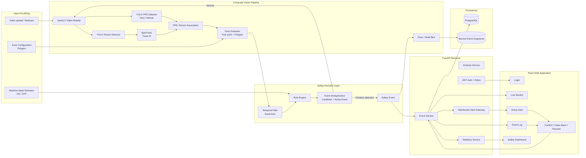
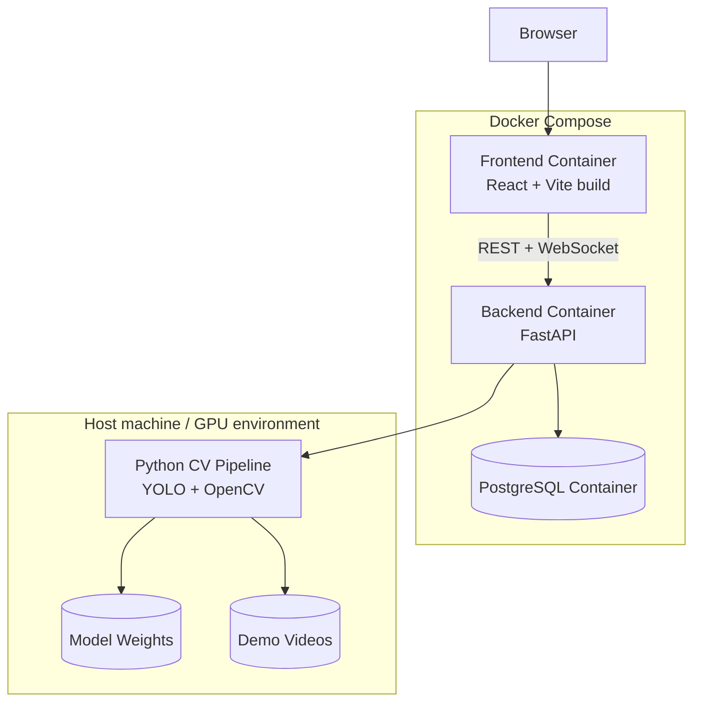

# Architecture Diagram

## System Architecture

```mermaid
flowchart LR
    subgraph INPUT["Input mô phỏng"]
        VID["Video upload / Webcam"]
        MACHINE["Machine State Simulator<br/>ON / OFF"]
        ZONE_CONFIG["Zone Configuration<br/>Polygon"]
    end

    subgraph CV["Computer Vision Pipeline"]
        READER["OpenCV Video Reader"]
        PERSON["YOLO Person Detector"]
        PPE["YOLO PPE Detector<br/>Vest / Helmet"]
        TRACKER["ByteTrack<br/>Track ID"]
        ASSOC["PPE–Person Association"]
        ZONE["Zone Evaluator<br/>Foot point + Polygon"]
        PRIVACY["Face / Head Blur"]
    end

    subgraph DOMAIN["Safety Decision Layer"]
        TEMPORAL["Temporal Filter<br/>Dwell time"]
        RULES["Rule Engine"]
        DEDUP["Event Deduplication<br/>Cooldown + Active Event"]
        EVENT["Safety Event"]
    end

    subgraph BACKEND["FastAPI Backend"]
        ANALYSIS["Analysis Service"]
        EVENT_API["Event Service"]
        WS["WebSocket Alert Gateway"]
        AUTH["JWT Auth + Roles"]
        STATS["Statistics Service"]
    end

    subgraph DATA["Persistence"]
        DB[("PostgreSQL")]
        SNAPSHOT[("Blurred Event Snapshots")]
    end

    subgraph UI["React Web Application"]
        LOGIN["Login"]
        LIVE["Live Monitor"]
        ALERT["Active Alert"]
        LOG["Event Log"]
        REVIEW["Confirm / False Alarm / Resolve"]
        DASHBOARD["Safety Dashboard"]
    end

    VID --> READER
    READER --> PERSON
    READER --> PPE

    PERSON --> TRACKER
    PPE --> ASSOC
    TRACKER --> ASSOC

    ASSOC --> ZONE
    ZONE_CONFIG --> ZONE

    ZONE --> TEMPORAL
    MACHINE --> RULES
    TEMPORAL --> RULES

    RULES --> DEDUP
    DEDUP -->|Violation detected| EVENT
    DEDUP -->|Normal| READER

    EVENT --> PRIVACY
    PRIVACY --> SNAPSHOT

    EVENT --> EVENT_API
    EVENT_API --> DB
    EVENT_API --> WS
    EVENT_API --> STATS

    AUTH --> LOGIN
    WS --> ALERT
    EVENT_API --> LOG
    EVENT_API --> LIVE
    STATS --> DASHBOARD

    ALERT --> REVIEW
    LOG --> REVIEW
    REVIEW --> EVENT_API
```

## Docker Compose Architecture

```mermaid
flowchart TB
    BROWSER["Browser"]

    subgraph DOCKER["Docker Compose"]
        FRONTEND["Frontend Container<br/>React + Vite build"]
        BACKEND["Backend Container<br/>FastAPI"]
        DB[("PostgreSQL Container")]
    end

    subgraph HOST["Host machine / GPU environment"]
        CVWORKER["Python CV Pipeline<br/>YOLO + OpenCV"]
        MODELS[("Model Weights")]
        VIDEOS[("Demo Videos")]
    end

    BROWSER --> FRONTEND
    FRONTEND -->|REST + WebSocket| BACKEND
    BACKEND --> DB
    BACKEND --> CVWORKER
    CVWORKER --> MODELS
    CVWORKER --> VIDEOS
```
